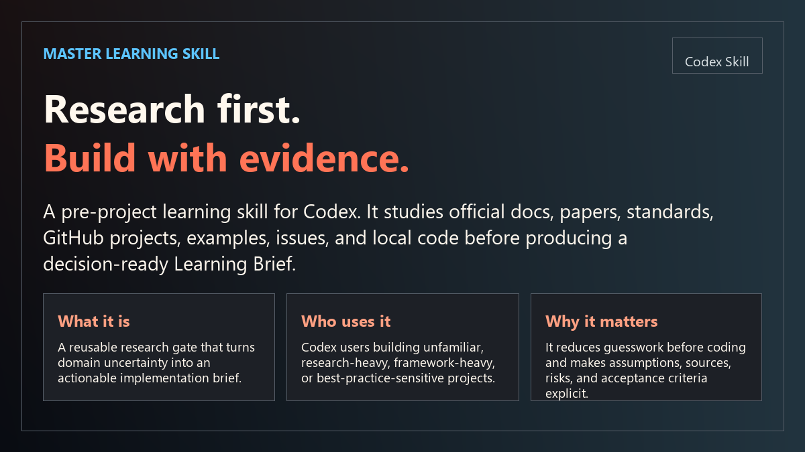
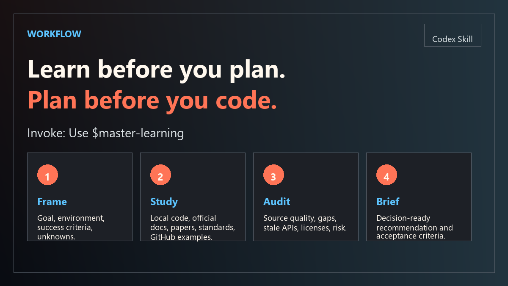
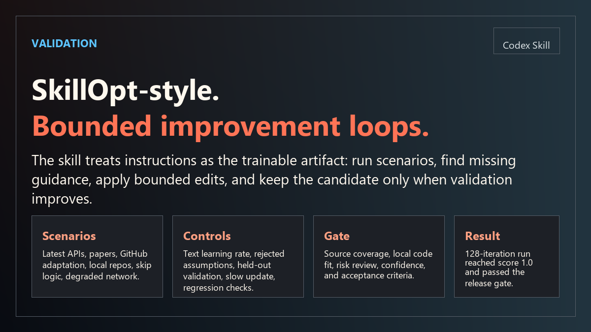
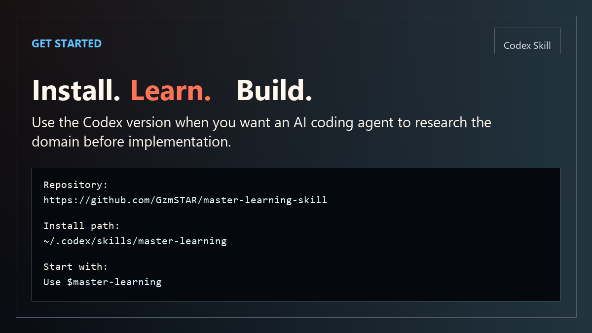

# Master Learning Skill



`master-learning` is a Codex skill for pre-project domain learning. It helps Codex research unfamiliar domains before planning or implementing, especially when a task depends on current documentation, papers, standards, GitHub repositories, examples, issues, tests, or local code conventions.

The core idea is simple: a master keeps the mind of an apprentice. Before building, learn the field.

## The Problem It Solves

AI coding agents are fast, but unfamiliar domains often punish speed. If an agent starts coding before reading current docs, paper assumptions, GitHub examples, local project conventions, and known failure modes, the result can be technically plausible but wrong.

`master-learning` adds a repeatable research gate before implementation. It turns vague uncertainty into a source-backed `Learning Brief`, so Codex can plan and build from evidence instead of stale memory or guesses.

## What This Skill Does

Many coding agents can write code quickly, but they often fail when the task requires learning first. A new framework, a paper-backed method, a GitHub ecosystem, a changing API, or a project with strong local conventions can make direct implementation risky.

`master-learning` adds a disciplined "learn before build" phase to Codex:

- Inspect local project files, dependency manifests, configs, tests, and existing conventions.
- Study official documentation, release notes, migration notes, standards, and specifications.
- Read papers and translate methods, assumptions, and evaluation setup into engineering constraints.
- Review GitHub repositories beyond stars: license, activity, examples, tests, issues, dependency health, and reuse risk.
- Mark weak evidence, stale APIs, source conflicts, abandoned repositories, missing licenses, and provisional conclusions.
- Produce a decision-ready `Learning Brief` before implementation begins.

The final `Learning Brief` becomes the handoff artifact for implementation. It explains what to build, what to avoid, which sources support the plan, what risks remain, and what acceptance criteria should be used.



## When To Use

Use `$master-learning` when you are:

- Starting a project in an unfamiliar technical or research domain.
- Choosing a framework, library, algorithm, paper method, or architecture.
- Asking Codex to follow latest docs, best practices, standards, or GitHub examples.
- Adapting a GitHub project into your own project.
- Working on a task where a wrong assumption would waste implementation time.
- Modifying a local project where existing conventions should be read before editing.

Do not use it for trivial edits, typo fixes, formatting-only work, or direct bug fixes with clear local evidence.

## What The Learning Brief Includes

The brief is designed for real engineering work, not for decorative research:

- `Task`: user goal, target environment, success criteria, research depth, and confidence.
- `Sources`: URLs or paths, source type, date or currency, reliability, and purpose.
- `Domain Model`: key concepts, objects, data, relationships, and vocabulary.
- `Local Code Lessons`: repository structure, conventions, configs, tests, and constraints.
- `GitHub/Code Lessons`: reviewed repositories, patterns, license and reuse notes, examples, and issues.
- `Paper/Standard Lessons`: methods, assumptions, evaluation setup, requirements, and limits.
- `Implementation Patterns`: architecture, API contracts, data flow, control flow, and test strategy.
- `Risks and Anti-Patterns`: weak assumptions, edge cases, stale docs, source conflicts, and things to avoid.
- `Recommendation`: proposed approach, acceptance criteria, and next steps.
- `Open Questions`: unresolved decisions or missing evidence.



## SkillOpt-Style Optimization

This repository includes a Microsoft SkillOpt-inspired local optimization workflow. It does not fine-tune a model. Instead, it treats `SKILL.md` as the trainable artifact, applies bounded text edits, and accepts a candidate only after validation.

Included artifacts:

- `master-learning/references/skillopt-training.md`
- `master-learning/scripts/skillopt_train.py`
- `master-learning/training/benchmark-scenarios.json`
- `master-learning/training/skillopt-run-2026-06-21.md`
- `master-learning/training/skillopt-run-2026-06-21-round2.md`
- `master-learning/training/skillopt-run-2026-06-21-128.md`

Scenario coverage:

- Latest framework and API tasks
- Paper reproduction tasks
- GitHub adaptation tasks
- Local-project-first tasks
- Low-risk skip behavior
- Network-degraded research

The 128-iteration stability run reached `score 1.0` and passed the release gate.



## Install

Clone this repository, then copy the `master-learning` skill folder into your Codex skills directory.

### Windows PowerShell

```powershell
git clone https://github.com/GzmSTAR/master-learning-skill.git
Copy-Item -Recurse -Force .\master-learning-skill\master-learning "$env:USERPROFILE\.codex\skills\master-learning"
```

### macOS / Linux

```bash
git clone https://github.com/GzmSTAR/master-learning-skill.git
mkdir -p ~/.codex/skills
cp -R master-learning-skill/master-learning ~/.codex/skills/master-learning
```

Restart Codex if the skill list does not refresh automatically.

### Quick Check

```bash
ls ~/.codex/skills/master-learning
```

## Usage

```text
Use $master-learning to study robot vision SLAM libraries, produce a Learning Brief, then plan the implementation.
```

```text
Use $master-learning before building this paper reproduction project. Check official docs, papers, GitHub repos, and known failure modes.
```

## Repository Structure

```text
master-learning/
  SKILL.md
  agents/openai.yaml
  references/
  scripts/
  training/
```

The helper scripts use only the Python standard library:

- `create_learning_brief.py`
- `github_scan.py`
- `paper_scan.py`
- `source_audit.py`
- `merge_learning_brief.py`
- `skillopt_train.py`

## Validation

```powershell
python "$env:USERPROFILE\.codex\skills\.system\skill-creator\scripts\quick_validate.py" "$env:USERPROFILE\.codex\skills\master-learning"
python "$env:USERPROFILE\.codex\skills\master-learning\scripts\skillopt_train.py" --help
```

## Related Version

Claude Code version:
https://github.com/GzmSTAR/master-learning-claude-code-skill

## License

MIT
